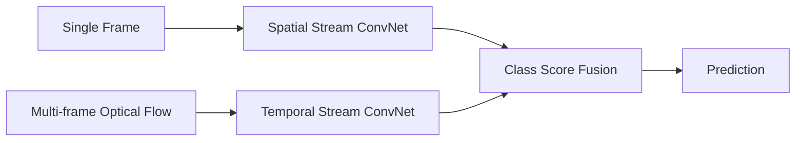

# Blackout-3# Two-Stream Convolutional Networks for Action Recognition

**How does AI understand an event in a video?**

[](https://arxiv.org/abs/1406.2199)
[](https://arxiv.org/abs/1406.2199)

A walkthrough of Simonyan & Zisserman's *"Two-Stream Convolutional Networks for Action Recognition in Videos"* (NeurIPS 2014), paired with an applied fall-detection implementation built on the same architecture.

> Based on: Simonyan & Zisserman, NeurIPS 2014 — presentation by Djaoud Khadidja, and an applied fall-detection case study.

---

## Table of Contents

- [1. Introduction](#1-introduction)
- [2. The Two-Stream Architecture](#2-the-two-stream-architecture)
  - [2.1 Spatial Stream ConvNet](#21-spatial-stream-convnet)
  - [2.2 Temporal Stream ConvNet](#22-temporal-stream-convnet--motivation)
- [3. What Is Optical Flow?](#3-what-is-optical-flow)
  - [3.1 Why Optical Flow Is Hard](#31-why-optical-flow-is-hard-its-an-ill-posed-problem)
- [4. ConvNet Input Configurations](#4-convnet-input-configurations)
  - [4.1 Optical Flow Stacking](#41-optical-flow-stacking-eq-1)
  - [4.2 Trajectory Stacking](#42-trajectory-stacking-eq-2)
  - [4.3 Bi-directional Optical Flow](#43-bi-directional-optical-flow)
  - [4.4 Mean Flow Subtraction](#44-mean-flow-subtraction)
- [5. Applied Case Study: Fall Detection](#5-applied-case-study-fall-detection-with-a-two-stream-network)
- [6. Summary](#6-summary)
- [Reference](#reference)

---

## 1. Introduction

A video is not just "a still image classifier applied many times." It carries **two fundamentally different kinds of information**:

| Component | What it captures | Example |
|---|---|---|
| **Spatial** | A single frame's appearance — objects, people, context | A tennis racket or a swimming pool can identify an action from *one* frame alone |
| **Temporal** | Motion across frames — how things move | The camera panning, a limb swinging, an object traveling. This is what separates a *punch* from a *wave* |

**Core idea of the paper:** instead of forcing one network to learn both appearance and motion at once (which prior deep video models struggled with), **build one ConvNet for each component and combine their predictions.** This is the *two-stream* architecture.

---

## 2. The Two-Stream Architecture



Both streams share the same underlying ConvNet layout (based on CNN-M-2048, similar to a shallow AlexNet/ZFNet-style network): `conv1 → conv2 → conv3 → conv4 → conv5 → full6 → full7 → softmax`, with ReLU activations, local response normalization, and 3×3 max-pooling (stride 2). Their **softmax scores are fused** at the end (by averaging, or by a linear SVM trained on the stacked scores).

### 2.1 Spatial Stream ConvNet

- Operates on **individual frames** → recognizes actions from still images.
- Static appearance alone is informative: many actions are strongly linked to specific objects or scenes.
- Fairly competitive **on its own** — because it's essentially an image classifier, it can be **pre-trained on ImageNet**, which is critical given how small video-action datasets are.
- The temporal stream (covered next) is what pushes accuracy meaningfully higher.

### 2.2 Temporal Stream ConvNet — motivation

Rather than feeding raw frames into a ConvNet and hoping it *implicitly* learns motion (which prior work like Karpathy et al.'s "slow fusion" showed to be hard), the temporal stream is fed **pre-computed dense optical flow** between frames.

> **Intuition:** motion is the single most informative signal for recognizing an action, so it's better to compute it explicitly beforehand (as optical flow) than to ask the network to guess it implicitly from raw pixels.

---

## 3. What Is Optical Flow?

When an object (e.g. a hand) moves between two consecutive frames, every pixel belonging to it shifts slightly. **Dense optical flow** computes, for *every pixel* in the image, a displacement vector describing where that pixel moved between frame *t* and frame *t+1*:

- **dˣ** — horizontal displacement (left/right)
- **dʸ** — vertical displacement (up/down)

So optical flow answers the question: *"for each pixel, where did it move to?"* — the vector field (dˣ, dʸ).

### 3.1 Why Optical Flow Is Hard: It's an Ill-Posed Problem

Given only two images, there are **infinitely many** motion fields that could explain the change between them. To make the problem solvable, classical optical-flow algorithms rely on a few key assumptions.

**1. Brightness Constancy Assumption**

The core assumption: a pixel's *intensity* doesn't change as it moves — only its position does.

```
I(u, v, t) = I(u + dx, v + dy, t + 1)
```

In words: the pixel at (u, v) in frame *t* has the same brightness as the pixel it moved to in frame *t+1*.

*Limitation:* breaks down under lighting changes, shadows, reflections, or transparency, where the same physical point can look different in brightness across frames.

**2. The Optical Flow Constraint Equation**

Applying a Taylor expansion to the brightness constancy assumption gives:

```
I(x+dx, y+dy, t+dt) ≈ I(x,y,t) + Iₓ·dx + I_y·dy + I_t·dt
```

where Iₓ, I_y, I_t are the image's spatial/temporal gradients. **The problem:** this is *one* equation with *two* unknowns (dx and dy) — it cannot be solved for a single pixel in isolation.

**3. The Aperture Problem**

If you look at motion through a small window (e.g. along a straight edge), you can only perceive motion **perpendicular** to the edge — motion *along* the edge is locally invisible. This is why extra assumptions are needed to resolve the ambiguity. Two classic approaches:

- **Lucas–Kanade (local method):** assumes flow is constant in a small neighborhood, and solves the equation using nearby pixels jointly.
- **Horn–Schunck (global method):** adds a global smoothness constraint — flow varies smoothly across the image except at motion boundaries.

The paper itself uses the Brox et al. energy-minimization method (constancy of intensity *and* its gradient, plus smoothness of the displacement field).

---

## 4. ConvNet Input Configurations

A ConvNet needs a fixed-size input, and a single optical-flow pair only gives one instant of motion. The paper explores several ways to pack multiple flow fields into one input volume.

### 4.1 Optical Flow Stacking (Eq. 1)

A dense optical flow can be seen as a set of displacement vector fields **d**ₜ between consecutive frame pairs *(t, t+1)*. To give the network more than a single instant of motion, we stack the flow from **L** consecutive frame pairs into **one input volume**, exactly like the 3 channels (R,G,B) of a color image — except here we have **2L channels**: (dx₁, dy₁, dx₂, dy₂, …, dxL, dyL).

```
Iτ(u, v, 2k−1) = dxτ+k−1(u, v)
Iτ(u, v, 2k)   = dyτ+k−1(u, v),    u=[1,w], v=[1,h], k=[1,L]
```

Each "pixel" of this volume now encodes **the evolution of motion at that fixed point** over L successive frames.

### 4.2 Trajectory Stacking (Eq. 2)

Optical-flow stacking always samples the *same fixed pixel* (u, v) across every frame. **Trajectory stacking** instead follows one physical point as it actually moves through the video, sampling the flow *along its path*:

```
p₁ = (u, v)
pₖ = pₖ₋₁ + d_{τ+k−2}(pₖ₋₁),   k > 1
```

Instead of asking *"what motion happens at this fixed window?"*, trajectory stacking asks *"what motion does this specific moving point experience over time?"* — inspired by classical trajectory-based hand-crafted descriptors.

### 4.3 Bi-directional Optical Flow

The representations above are **forward-looking only** (frame *t* → *t+1*). Bi-directional flow splits the L stacked frames in half: L/2 forward flows (τ → τ+L/2) and L/2 backward flows (τ−L/2 → τ), keeping the same total channel count (2L), but centering the motion window on the current frame instead of only extending forward. In practice this gives only a small accuracy gain over purely forward flow.

### 4.4 Mean Flow Subtraction

Neural networks with ReLU activations train better when inputs are centered around zero. Displacement vectors are naturally centered in principle, but a *given pair of frames* is often dominated by one particular direction of motion — most commonly because **the camera itself is moving** (panning, shaking). The fix: subtract the **mean displacement vector** from every point in each flow field. This removes the large uniform shift caused by camera motion, leaving mostly the motion local and specific to the action — a simple stand-in for full camera-motion compensation, and it consistently improves accuracy.

---

## 5. Applied Case Study: Fall Detection with a Two-Stream Network

The accompanying notebook (`Fall Detector — Two-Stream ConvNet, v2`) detects a person falling in the **Le2i Fall Detection Dataset**.

### Pipeline Components

| Step | What it does |
|---|---|
| **Video discovery + labeling** | Scans the dataset, reads Le2i's per-video annotation `.txt` files (`fall_start_frame` / `fall_end_frame`, `0,0` = no fall) |
| **Crash-safe decoding** | `read_frames()` decodes via an **ffmpeg subprocess** rather than in-process `cv2.VideoCapture`, so a corrupted file can't crash the kernel |
| **`compute_flow_stack`** | Implements the paper's Eq. (1): stacks dx/dy of L=10 consecutive Farneback optical flows into a (2L, H, W) volume, with mean-flow subtraction |
| **`SpatialFallDataset` / `TemporalFallDataset`** | PyTorch `Dataset`s returning an RGB frame or a flow-stack tensor respectively, with random crop + flip augmentation (a horizontal flip on the temporal stream also flips the **sign** of dx, to keep the flow direction consistent) |
| **Models** | Both streams use a **ResNet-18** backbone (paper used CNN-M-2048; ResNet-18 is a modern, more efficient substitute). The temporal stream's first conv layer is expanded to accept 2L=20 channels, using **cross-modality initialization** (ImageNet RGB filters averaged and replicated across the 20 channels) rather than training from scratch |
| **Training loop** | Shared by both streams: class-weighted cross-entropy loss, best checkpoint chosen by **validation macro-F1** (more informative than raw accuracy on an imbalanced dataset), early stopping |
| **Two-stream fusion** | Late fusion by averaging softmax scores (paper Sect. 2), evaluated "densely" by averaging over several samples drawn from each validation sample's assigned region — mirroring the paper's multi-crop test-time averaging |

### Not Yet Implemented

1. **SVM-based fusion** instead of simple averaging (the paper shows SVM fusion beats averaging).
2. **Trajectory stacking** (Eq. 2) and **bi-directional flow** — smaller expected gains, but straightforward extensions of `compute_flow_stack`.

---

## 6. Summary

| Question | Answer |
|---|---|
| Why two streams? | Appearance (spatial) and motion (temporal) are complementary signals that are easier to learn separately than jointly |
| Why optical flow instead of raw frame stacks? | Motion is the most important cue for action recognition; computing it explicitly (rather than making the network infer it) makes learning easier and works well even with small training sets |
| How is multi-frame motion fed to a ConvNet? | By stacking dx/dy channels from L consecutive flow fields into one (2L)-channel input volume, optionally sampled along point trajectories rather than fixed pixels |
| What makes optical flow computable at all? | The brightness constancy assumption + a smoothness/local-constancy assumption to resolve the aperture problem |
| Does this generalize to real applications? | Yes — the fall-detection case study shows the same architecture, trained on a much smaller domain-specific dataset |

---

## Reference

Karen Simonyan, Andrew Zisserman. **"Two-Stream Convolutional Networks for Action Recognition in Videos."** Visual Geometry Group, University of Oxford. arXiv:1406.2199v2, 2014.

- 📄 Paper: [arXiv:1406.2199](https://arxiv.org/abs/1406.2199)
- 🎥 Video presentation: [YouTube playlist](https://youtube.com/playlist?list=PL2zRqk16wsdoYzrWStffqBAoUY8XdvatV&si=HTqZJTIqJBmI7taC)
